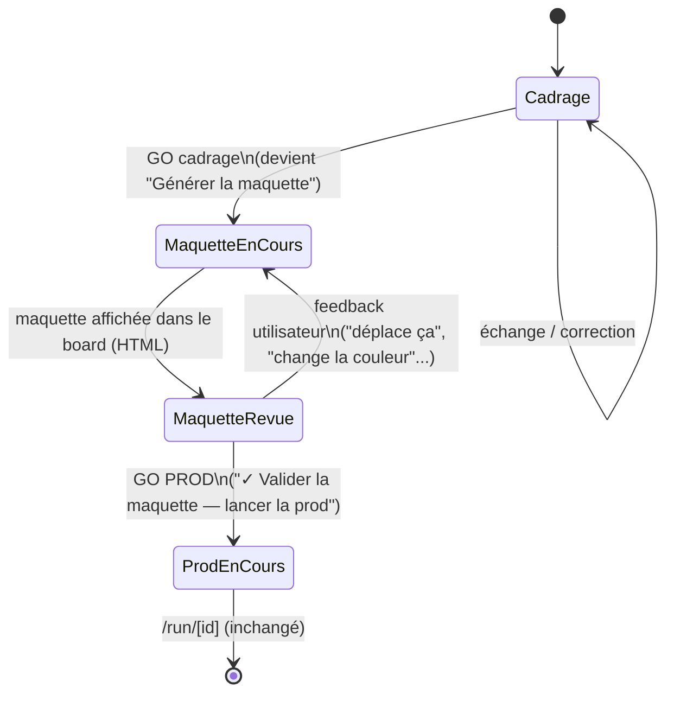

# 16 — Maquette avant prod (valider la forme avant de lancer l'équipe)

> Demande de Ben (verbatim) : « Quand on dit GO sur un cahier des charges de site web, je
> veux surtout voir une MAQUETTE. C'est là tout le sens du board. Un cadrage peut être
> validé, mais on veut surtout valider la MAQUETTE avant de lancer l'équipe de prod ! C'est
> tout l'intérêt d'échanger devant une maquette plutôt qu'un résultat fini. Je veux que ce
> comportement soit intégré sur l'appli Cleveria. »
>
> Cadrage PO — 2026-07-03. Portée : **V1 = site web / app visuelle** (le cas de Ben).
> Généralisation aux livrables non visuels (business plan, dossier asso…) posée en
> principe (§2) mais **hors périmètre des tickets V1**.

## Convention (à réutiliser telle quelle par le développeur et la QA)

- Projet **CLV** (déjà en usage dans [`BACKLOG.md`](./BACKLOG.md)). Tickets **`CLV-N`**,
  numérotation **contiguë et globale** — dernier ticket numéroté avant celui-ci :
  `CLV-22` (`CLV-MEM` est une étiquette d'épic V2, pas un ticket numéroté, donc hors
  séquence). Cette feature part donc à **`CLV-23`**.
- Regroupement en épic pour la lisibilité de ce document : **`CLV-E-MAQUETTE`** — une
  étiquette de regroupement, **pas** un nouveau schéma d'ID (même pattern que
  `CLV-E-HIST` dans `docs/13`).
- État : ⬜ à faire · 🟦 en cours · ✅ fait · 🔶 à valider (Ben) — même code que
  `BACKLOG.md`.
- Ce document est la source de vérité fonctionnelle ; `BACKLOG.md` est mis à jour en écho
  (section ajoutée en bas de ce fichier, avec lien retour ici).

---

## 1. Le nouveau parcours à deux étages

Aujourd'hui (`app/voice/page.tsx`) : cadrage → need card dans le board → **un seul GO**
(« ✓ GO — lancer l'équipe ») → `POST /api/run` → l'orchestrateur planifie et exécute le
DAG complet → résultat sur `/run/[id]`. Un run complet mobilise plusieurs agents, prend du
temps et coûte cher — et aujourd'hui, rien ne protège contre le fait de le lancer sur une
direction (structure, ton, hiérarchie) que le client n'a pas encore vue ni validée.

**Nouveau parcours (site web / app visuelle) :**



Précisions par état :

- **Cadrage** — inchangé. La need card se construit dans le board (Markdown), le GO
  apparaît dès que le besoin est cristallisé (`launchNote`, `app/voice/page.tsx:1210`).
- **GO cadrage → maquette** — **le bouton unique actuel change de comportement** pour les
  projets visuels (cf. §2 pour la classification) : au lieu d'appeler `confirmGo()` /
  `/api/run` directement, il appelle un nouvel appel dédié qui génère la maquette (§4/§6).
  Le label change en conséquence (« ✓ Générer la maquette » plutôt que « lancer l'équipe »)
  — on ne doit jamais laisser croire à l'utilisateur qu'il vient de lancer la prod alors
  qu'il vient de commander un aperçu.
- **Maquette en cours** — état transitoire (streaming de la génération), le board bascule
  de son rendu Markdown habituel à un rendu HTML (§3).
- **Maquette revue** — la maquette est affichée dans le board. Le chat reste ouvert : tout
  message de l'utilisateur tant que la maquette n'est pas validée est traité comme un
  **feedback d'itération**, pas comme un nouveau tour de cadrage classique (regénère la
  maquette, §4). **Un nouveau bouton distinct apparaît à ce stade** : « ✓ Valider la
  maquette — lancer la prod ». C'est lui, et lui seul, qui déclenche `/api/run` pour les
  projets visuels.
- **Prod en cours / terminé** — inchangé (`/run/[id]`), sauf que le brief transmis inclut
  désormais la maquette validée (§5, CLV-31) — la production doit produire *ce site-là*,
  pas redécouvrir la structure depuis zéro.

**Pour les projets non visuels** (business plan, dossier asso…) : le comportement actuel
est **conservé tel quel** en V1 — un seul GO qui lance directement `/api/run`. Le
changement ne s'applique qu'aux projets où « une maquette » a un sens concret (§2).

---

## 2. Définir « maquette » selon le type de projet

**Site web / app** → la maquette est une **page rendue visuellement** (HTML/CSS
autonome), avec une vraie hiérarchie, une vraie mise en page, du contenu réaliste (pas du
lorem ipsum) — ce qu'on peut montrer et commenter à l'écran (« mets ce bloc en premier »,
« cette couleur ne va pas »). Pas un pavé de texte qui *décrit* une page.

**Généralisation honnête.** Le principe derrière la demande de Ben n'est pas « toujours du
HTML » — c'est : *avant d'engager une production coûteuse et multi-agents, valider la
FORME du livrable dans un format que le client peut juger d'un coup d'œil, avant d'en payer
le contenu détaillé.* Pour un livrable non visuel, l'équivalent est un **plan annoté + un
extrait représentatif** (le sommaire commenté d'un business plan avec une section rédigée
en exemple ; la structure d'un dossier de mécénat avec l'angle de chaque partie) — c'est
d'ailleurs déjà une partie du mandat de `factory-ux-ui` aujourd'hui (« propose des
maquettes en bas-fidélité… avant tout visuel léché »), mais ce n'est **pas aujourd'hui une
étape bloquante avant le GO prod** — le GO va toujours directement à `/api/run`. Étendre le
même gate (validation obligatoire d'une forme légère avant la prod complète) aux livrables
structurés est cohérent, mais **hors périmètre V1** — posé ici pour que l'architecture ne
ferme pas la porte (cf. §5, ticket V2 non détaillé).

**Quand l'étape maquette s'applique, quand on va direct à la prod.** Deux conditions
cumulatives :
1. Le livrable a une **forme** qui peut être fausse indépendamment du contenu (mise en
   page, structure, hiérarchie) — un site en a une, une réponse courte à une question n'en
   a pas.
2. La production derrière est **non triviale** — l'orchestrateur mobiliserait plusieurs
   agents (`ux-ui`, `developpeur`, `lead-tech`, `qa`…), pas un plan minimal à 0-1 étape. Un
   besoin déjà largement traité au cadrage n'a rien à gagner à un aller-retour maquette (la
   doctrine de `factory-orchestrateur` — « ne sors pas l'usine pour une vis » — s'applique
   symétriquement ici : pas de gate pour un run qui n'a rien de coûteux à protéger).

En V1, ce couple de conditions est **simplifié à une classification binaire au cadrage** :
« ce projet est-il un site web / une app visuelle ? » (§5, CLV-28). La généralisation fine
(point 1 vs point 2 évalués séparément) est un raffinement V2.

---

## 3. Rendu de la maquette dans le board — à trancher par l'architecte

Le board rend aujourd'hui du **Markdown** (`app/components/Markdown.tsx` : `marked.parse`
+ `dangerouslySetInnerHTML`, plus un rendu Mermaid dédié). Une maquette de site est du
**HTML/CSS complet, généré par un LLM** — un type de contenu structurellement différent, et
une **surface d'injection** (le HTML n'est pas écrit par nous). Je ne tranche pas la
solution technique — voici ce que l'architecte doit décider :

- **Mécanisme de rendu isolé** : `<iframe>` avec `srcdoc` (sandbox stricte, ex. sans
  `allow-scripts` ni `allow-same-origin` combinés — à vérifier, cette combinaison peut
  justement défaire l'isolation) ? Une route dédiée servant le HTML généré avec CSP
  propres, potentiellement sur une **origine séparée** (pattern standard des previews
  HTML générés — type CodeSandbox/StackBlitz — la plus forte isolation, au prix d'une
  infra en plus : sous-domaine, CSP, messaging cross-origin) ? Ou un rendu scopé dans la
  page (shadow DOM / CSS scoping) — plus léger mais fuite de style et XSS moins bien
  contenus par défaut ?
- **Sécurité** : le HTML est produit par un LLM à partir d'un feedback utilisateur libre —
  traiter comme du **contenu non fiable**. Faut-il bloquer toute ressource externe (pas de
  `<script src>` externe, pas de `fetch`/`XHR` sortant), sanitizer les tags dangereux même
  sous sandbox (défense en profondeur), interdire les CDN (ex. Tailwind via `<script>`
  CDN — pratique mais introduit une dépendance externe et un script exécuté, à éviter si le
  parti pris est « pas de script du tout ») ?
- **Schéma du board** : aujourd'hui `Board = { title, content }` (`content` = Markdown).
  Il faut un champ de discrimination (ex. `kind: "markdown" | "html"`) répercuté partout où
  `Board` est utilisé : `app/voice/page.tsx` (state + rendu), `lib/history.ts` (persistance
  IndexedDB de la conversation — le HTML doit survivre à un refresh comme le Markdown),
  export (`downloadBoard()` exporte `.md` aujourd'hui — une maquette devrait s'exporter en
  `.html`, MIME à adapter).
- **Streaming** : aujourd'hui le board se construit token par token pendant que l'agent
  écrit (`ps.board`, `showLive` dans `app/voice/page.tsx`). Du HTML streamé tag par tag ne
  se monte pas proprement dans un iframe à mi-génération (tags coupés). Mon avis non
  contraignant : afficher un état « la maquette se construit… » pendant la génération
  serveur, et ne monter l'iframe **qu'une fois le HTML complet reçu** — plus simple et plus
  sûr qu'un rendu incrémental, et la cadence d'itération (quelques allers-retours, pas un
  flux continu) ne justifie pas la complexité d'un rendu partiel.
- **Aperçu responsive** : viewport unique en V1, ou bascule desktop/mobile ? Pas requis
  par la demande de Ben — à garder en tête comme extension naturelle, pas un blocage V1.

---

## 4. Qui produit la maquette

**Nouvel agent dédié : `factory-maquettiste`** (recommandation PO, la décision
d'architecture finale revient à dev/architecte comme d'habitude), plutôt que réutiliser
`factory-ux-ui` :
- `factory-ux-ui` a aujourd'hui un mandat **stratégique** (audience, narration, wireframe
  bas-fidélité *en amont d'autres agents*) — pas un contrat de sortie technique (HTML
  autonome, sandboxable, sans dépendance externe).
- Le contrat de sortie d'une maquette est très spécifique et contraint par la sécurité du
  rendu (§3) : un seul fichier HTML/CSS auto-suffisant, pas de script, pas de ressource
  externe. Mieux vaut l'isoler dans son propre prompt que de surcharger celui d'`ux-ui`.
- Le **modèle** utilisé doit être délibérément **rapide et peu coûteux** (sonnet, pas
  opus — cf. §6 coût) puisque la maquette est jetable et itérée plusieurs fois ; en faire un
  agent séparé rend ce choix explicite et réglable indépendamment d'`ux-ui`.

**Itératif par construction** — c'est le cœur de la demande de Ben. Chaque itération
regénère la maquette à partir de trois entrées : (1) le besoin cadré (need card /
`launchNote`), (2) le HTML de la maquette précédente, (3) le message de feedback de
l'utilisateur (« déplace ça », « change la couleur »…). **V1 : régénération intégrale du
HTML** à chaque itération (pas de patch ciblé) — plus robuste qu'une édition partielle
pilotée par LLM sur du HTML (risque de casser la structure), au prix d'un coût par
itération légèrement plus élevé mais qui reste très inférieur à un run complet. Une
régénération ciblée (ne toucher que la section mentionnée) est une optimisation V2
valable mais pas un prérequis V1.

**Mini-run ou appel dédié ?** Un appel dédié, **hors de l'orchestrateur** (`orchestrate()`
/ `runStore.ts` / `/run/[id]`) — voir détail en §6.

---

## 5. Épics & tickets — V1 « site web »

### Épic `CLV-E-MAQUETTE` — Maquette visuelle avant GO prod

| # | Titre | État | Dépend de |
|---|---|---|---|
| CLV-23 | Nouvel agent `factory-maquettiste` | ⬜ | — |
| CLV-24 | Endpoint `POST /api/maquette` (génération + itération) | ⬜ | CLV-23 |
| CLV-25 | Rendu HTML sandboxé dans le board (`MockupFrame`) | ⬜ | — (parallélisable avec CLV-23/24) |
| CLV-26 | Extension du type `Board` (`kind`) + persistance HTML | ⬜ | CLV-25 ; recoupe CLV-8 |
| CLV-27 | Le GO cadrage bascule vers « générer la maquette » (projets visuels) | ⬜ | CLV-24, CLV-25, CLV-26, CLV-28 |
| CLV-28 | Classification « projet visuel ? » au cadrage | ⬜ | — (à mutualiser avec CLV-5) |
| CLV-29 | Itération de la maquette dans le chat | ⬜ | CLV-24, CLV-27 |
| CLV-30 | Barre de validation → GO PROD dédié | ⬜ | CLV-27, CLV-29 |
| CLV-31 | La maquette validée est injectée dans le run prod | ⬜ | CLV-30 |

**CLV-23 — Nouvel agent `factory-maquettiste`**
Créer `factory-maquettiste.md` (roster Factory, cf. `.claude/agents/`) : produit une
**page HTML/CSS autonome, un seul fichier, aucun script, aucune dépendance externe
(pas de CDN)**, à partir d'un besoin cadré (et, en itération, du HTML précédent + un
feedback). Ton et contenu réalistes (pas de lorem ipsum), cohérents avec la marque déjà
cadrée si connue.
**Fait = ** testé manuellement sur 3 cadrages « site vitrine » distincts → à chaque fois
un HTML qui s'ouvre sans erreur dans un navigateur, sans tag cassé, sans `<script>` ni
ressource externe.

**CLV-24 — Endpoint `POST /api/maquette`**
Reçoit `{ brief, previousHtml?, feedback? }`, appelle `factory-maquettiste`, **streame**
la génération (même plomberie que `/api/brief`, pas celle de `runStore`/SSE des runs
multi-agents). Sans `feedback` → première génération ; avec `feedback` → régénération
intégrale intégrant la demande. Erreurs LLM traduites via `humanError` (`lib/orchestrator.ts`).
**Fait = ** un appel sans feedback renvoie un HTML complet et valide ; un appel avec
`previousHtml` + feedback renvoie un HTML différent qui intègre visiblement le changement
demandé (vérifié manuellement sur 3 cas : couleur, ordre de sections, texte).

**CLV-25 — Rendu HTML sandboxé dans le board**
Nouveau composant (`MockupFrame` ou équivalent) qui rend le HTML de la maquette dans le
board, isolé selon la décision de l'architecte (§3). Remplace `Markdown` quand
`board.kind === "html"`.
**Fait = ** un `<script>` injecté volontairement dans un HTML de test ne s'exécute pas ;
aucune fuite de style CSS de la maquette vers le reste de l'appli (et réciproquement).

**CLV-26 — Extension du type `Board` + persistance**
`Board = { title, content, kind?: "markdown" | "html" }` propagé à `app/voice/page.tsx`,
`lib/history.ts` (IndexedDB), export (`downloadBoard` → `.html` quand `kind === "html"`).
**Fait = ** une conversation avec une maquette affichée survit à un refresh navigateur
(maquette restaurée, pas de perte) — même exigence que CLV-8 pour le Markdown ; à traiter
ensemble si CLV-8 n'est pas déjà fait.

**CLV-27 — Le GO cadrage bascule vers « générer la maquette »**
Sur la barre GO existante (`app/voice/page.tsx`, bloc `launchNote && !loading`) : si le
projet est classé visuel (CLV-28), le bouton devient « ✓ Générer la maquette » et appelle
`/api/maquette` au lieu de `confirmGo()`. Sinon, comportement actuel inchangé.
**Fait = ** sur un cadrage « site vitrine », cliquer le bouton affiche la maquette dans le
board (jamais le dashboard `/run`) ; sur un cadrage non visuel (business plan), le clic
lance `/api/run` directement comme aujourd'hui.

**CLV-28 — Classification « projet visuel ? » au cadrage**
La need card porte un indicateur déterministe (ex. `deliverableType`) posé par l'IA de
cadrage.
**Fait = ** sur un jeu de 10 cadrages variés (site vitrine, appli, business plan, dossier
asso, appel aux dons…), la classification est correcte sur ≥ 9/10 (mesuré) — même barre
d'exigence que CLV-5 ; à mutualiser avec ce chantier de sortie structurée si le calendrier
le permet.

**CLV-29 — Itération de la maquette dans le chat**
Une fois la maquette affichée, tout message utilisateur (tant qu'elle n'est pas validée)
déclenche un appel `/api/maquette` avec feedback (pas un tour de cadrage classique). Le
board se met à jour ; le fil de chat garde une trace lisible de chaque itération.
**Fait = ** taper « change la couleur du bouton principal en vert » régénère la maquette
et le changement est visible dans le board, sans repasser par un cadrage/need card.

**CLV-30 — Barre de validation → GO PROD dédié**
Nouveau bloc « ✓ Valider la maquette — lancer la prod », visible uniquement en état
« maquette revue ». Lui seul appelle `/api/run`.
**Fait = ** tant que ce bouton n'est pas cliqué, aucun run n'est créé (vérifiable :
`runStore` ne contient aucune entrée) ; le cliquer lance bien `/api/run` et redirige vers
`/run/[id]` comme aujourd'hui.

**CLV-31 — La maquette validée est injectée dans le run prod**
`buildBrief()` (`app/voice/page.tsx:518`) inclut le HTML de la maquette validée dans le
brief transmis à `/api/run`. Le plan de l'orchestrateur (ou la consigne des agents
`ux-ui`/`developpeur`) doit référencer explicitement cette maquette comme la structure à
respecter — **pas juste comme du texte informatif noyé dans le brief**.
**Fait = ** dans le livrable produit par l'agent développeur/ux-ui du run prod, la
structure de page reprend visiblement celle validée dans la maquette (sections, ordre —
pas une structure réinventée). *C'est le critère qui empêche la maquette de n'être qu'un
théâtre visuel sans effet sur la prod réelle : une maquette qui plaît mais que la prod
ignore est non conforme, pas « presque fini ».*

### V2 (hors périmètre, posé pour ne pas fermer la porte)

**CLV-32 — Étendre le gate maquette aux livrables structurés non visuels** (business plan,
dossier asso…) via l'équivalent « plan annoté + extrait » (§2). Non chiffré ici.

---

## 6. Points de vigilance

**Coût.** Une génération de maquette = **un seul appel LLM** (agent `maquettiste`), contre
un run complet qui mobilise potentiellement 4 à 8 agents (`ux-ui`, `developpeur`,
`lead-tech`, `qa`…) — un ordre de grandeur moins cher, c'est tout l'intérêt de l'étape.
Point d'attention : le coût **cumulé** sur plusieurs itérations (Ben corrigeant la
maquette 5-6 fois) peut se rapprocher d'un run si on ne fait rien. Mitigations proposées :
modèle rapide/économique pour `factory-maquettiste` (sonnet, pas opus — cf. §4) ;
instrumenter le **nombre d'itérations avant validation** (même logique que CLV-10) pour
avoir un signal réel avant d'optimiser prématurément.

**Sécurité du rendu HTML.** Traiter tout HTML généré comme **contenu non fiable** — c'est
la sortie d'un LLM piloté par un feedback utilisateur libre. Voir §3 pour les options
d'isolation (iframe sandbox stricte vs origine séparée) : l'architecte doit trancher, avec
une préférence forte pour bloquer scripts et ressources externes plutôt que sanitizer a
posteriori.

**Articulation avec l'orchestrateur existant.** La génération de maquette est
**volontairement en dehors** de `orchestrate()`/`runStore.ts`/`/run/[id]` : pas de `Run`,
pas de DAG, pas de dashboard multi-étapes — un appel direct à un agent, streamé, sur le
modèle de `/api/brief` (qui fait déjà exactement ça pour construire le board en Markdown).
Créer une entrée dans le lourd mécanisme de runs multi-agents pour un seul appel serait de
la sur-ingénierie. Une fois la maquette **validée**, le parcours rejoint l'existant sans
modification structurelle : `buildBrief()` produit le brief (enrichi de la maquette,
CLV-31), `/api/run` et `orchestrator.ts` tournent exactement comme aujourd'hui.

**Échec de génération.** Si l'appel à `factory-maquettiste` échoue (crédit, réseau —
`humanError`), ne jamais retomber silencieusement sur un lancement direct de la prod (ça
viderait le gate de son sens). Proposer un nouvel essai ; si l'utilisateur veut vraiment
sauter l'étape, ce doit être un choix explicite et visible, pas un repli automatique.

---

## Backlog — écho `BACKLOG.md`

Section à ajouter dans `BACKLOG.md`, pattern identique à `CLV-E-HIST` :

```
## 🟠 Maquette avant prod — épic CLV-E-MAQUETTE

Cadrage complet : [`16-maquette-avant-prod.md`](./16-maquette-avant-prod.md).
Entre le cadrage validé et le lancement de l'équipe de prod : générer une maquette
visuelle (site web) dans le board, l'affiner par itération dans le chat, et ne lancer
la prod qu'une fois la maquette validée.

### ⬜ CLV-23 — Nouvel agent `factory-maquettiste`
### ⬜ CLV-24 — Endpoint `POST /api/maquette` (génération + itération)
### ⬜ CLV-25 — Rendu HTML sandboxé dans le board (`MockupFrame`)
### ⬜ CLV-26 — Extension du type `Board` (`kind`) + persistance HTML — recoupe CLV-8
### ⬜ CLV-27 — Le GO cadrage bascule vers « générer la maquette » (projets visuels)
### ⬜ CLV-28 — Classification « projet visuel ? » au cadrage — à mutualiser avec CLV-5
### ⬜ CLV-29 — Itération de la maquette dans le chat
### ⬜ CLV-30 — Barre de validation de la maquette → GO PROD dédié
### ⬜ CLV-31 — La maquette validée est injectée dans le run prod
```
