# 19 — Le service phare : créer ou rebrander un site web (parcours maquette-first)

> Re-cadrage PO — 2026-07-03. **Ce document prévaut sur l'ordre des étapes des docs
> [`16-maquette-avant-prod.md`](./16-maquette-avant-prod.md) et
> [`18-maquette-archi.md`](./18-maquette-archi.md).** Le technique du doc 18 qui reste
> valide (rendu `<iframe sandbox="">`, agent `factory-maquettiste`, `Board.kind`) est
> **réutilisable tel quel** — voir §6. Ce qui change : (1) le service est maintenant défini
> précisément (création OU rebranding, avec une URL en entrée possible), (2) le CDC n'est
> **plus une étape client** — c'est un brief interne dérivé de la maquette, (3) le **devis
> est explicitement le moment de facturation** et le lancement de l'équipe de prod est
> **gated par le paiement**, jamais un bouton libre au milieu du parcours.

## Convention (à réutiliser telle quelle par le développeur et la QA)

- Projet **CLV** (déjà en usage dans [`BACKLOG.md`](./BACKLOG.md)). Tickets **`CLV-N`**,
  numérotation **contiguë et globale** — dernier ticket numéroté avant celui-ci : `CLV-32`
  (épic `CLV-E-MAQUETTE`, doc 16). Cette feature part donc à **`CLV-33`**.
- Regroupement en épic pour la lisibilité : **`CLV-E-SITE`** (le service lui-même :
  capture d'URL, funnel gratuit maquette→devis) et **`CLV-E-PAIEMENT`** (le gate
  payant + lancement post-paiement, hors V1 — posé pour ne pas fermer la porte). Étiquettes
  de regroupement, **pas** un nouveau schéma d'ID (même pattern que `CLV-E-HIST`,
  `CLV-E-MAQUETTE`).
- État : ⬜ à faire · 🟦 en cours · ✅ fait · 🔶 à valider (Ben) — même code que
  `BACKLOG.md`.
- Ce document est la source de vérité fonctionnelle sur le **service** et son **parcours**.
  Les docs 16/18 restent la source de vérité **technique** pour le rendu de la maquette
  (iframe sandbox, agent maquettiste) — non réécrits ici, seulement référencés.

---

## 1. Définition du service

Le service phare de Cleveria : **créer ou rebrander un site web.** Deux entrées possibles
au démarrage de la conversation :

**A. Création — description en entrée.** Le client décrit ce qu'il veut (« un site vitrine
pour mon activité de plombier », « une landing page pour mon association »). Pas de contenu
existant à capter — la maquette part d'une page blanche, alimentée par le cadrage
conversationnel habituel.

**B. Rebranding — URL en entrée.** Le client donne l'URL de son site actuel. On **capte son
contenu** : textes, structure de navigation, offre/produits, ton — pas le design (le
rebranding sert justement à changer le design). Ce contenu capté sert de matière première à
la maquette : le maquettiste part d'une base réelle (le texte de l'offre existante, la
structure des pages) plutôt que d'inventer un contenu réaliste depuis zéro. Le client
retrouve *son* propos, dans une forme nouvelle — c'est ce qui rend le premier jet de
maquette immédiatement pertinent au lieu de « encore un site générique ».

**Ce qu'on capte, ce qu'on n'en fait pas** :
- Capté : texte (titres, paragraphes, offre, coordonnées), structure de pages/sections,
  éventuellement la hiérarchie de navigation.
- Explicitement **pas capté / pas répliqué** : le design, la mise en page, le CSS, les
  visuels — le but est de rebrander, pas de photocopier la forme actuelle.
- La capture est un **input pour le maquettiste**, pas un livrable en soi ; le client ne
  voit jamais « le contenu brut capté » comme un écran séparé — il voit directement la
  maquette qui en résulte.

**Piste technique à flécher pour le lead-tech (ne pas la résoudre ici).** `lib/research.ts`
expose déjà `readUrl()` (Jina Reader, `r.jina.ai`, gratuit sans clé, renvoie du markdown
propre même sur du contenu JS-rendu) — c'est le candidat naturel pour la capture d'URL de
ce service. Reste à trancher par le lead-tech : où insérer cet appel dans le flux (au
premier message si une URL est détectée ? sur action explicite ?), comment le contenu capté
est transmis au maquettiste (brut vs résumé), gestion des URLs mortes/injoignables
(`ok: false` déjà remonté par `readUrl`), et si un site multi-pages nécessite plusieurs
appels ou seulement la page d'accueil en V1.

---

## 2. Le parcours — maquette-centrique, devis = facturation, prod gated par paiement

**Principe directeur (verbatim Benoit) : « on pinaille devant des maquettes pas devant des
cahiers des charges qui ne parlent qu'à ceux qui les rédigent. »** Le client valide un
**visuel**, jamais un document. Tout le funnel avant paiement tourne autour de la maquette,
pas d'un cahier des charges qu'il devrait lire et approuver.

```mermaid
stateDiagram-v2
    [*] --> Entree
    Entree --> Capture : URL fournie (rebranding)
    Entree --> MaquetteEnCours : description seule (création)
    Capture --> MaquetteEnCours : contenu capté injecté au maquettiste
    MaquetteEnCours --> MaquetteRevue : 1ère maquette affichée (auto, sans bouton)
    MaquetteRevue --> MaquetteEnCours : itération ("ce bouton en vert"...)
    MaquetteRevue --> Questions : question ciblée d'affinage
    Questions --> MaquetteEnCours : réponse intégrée → régénération
    MaquetteRevue --> Devis : maquette jugée satisfaisante
    Questions --> Devis : maquette jugée satisfaisante
    Devis --> [*] : GRATUIT jusqu'ici ; devis = moment de FACTURATION
    Devis --> Paiement : signature / paiement du devis
    Paiement --> ProdEnCours : SEUL déclencheur de /api/run
    ProdEnCours --> [*] : /run/[id] (inchangé)
```



Précisions par état :

- **Entrée** — le client démarre par une description libre OU colle une URL. Détection au
  cadrage (cf. CLV-28 du doc 16, réutilisable : classification « projet visuel ? » —
  étendue ici pour aussi détecter la présence d'une URL).
- **Capture** *(si URL)* — appel de capture (§1), contenu injecté comme matière première du
  premier brief envoyé au maquettiste. Étape invisible pour le client : pas d'écran
  intermédiaire « voici ce qu'on a capté », on va directement à la maquette.
- **Maquette en cours / Maquette revue** — reprend intégralement le mécanisme déjà tranché
  dans les docs 16/18 (génération automatique, sans bouton ; itération = régénération
  intégrale du HTML sur feedback ; rendu iframe sandbox dans le board). **Rien ne change
  ici** — voir §6.
- **Questions** — quelques questions ciblées peuvent s'intercaler pour affiner (public visé,
  fonctionnalités attendues, contenu manquant) — jamais un formulaire séquentiel long (même
  doctrine que CLV-7 : une correction/réponse = une interaction courte). Les réponses
  réinjectent dans le brief et redéclenchent une régénération de maquette si elles ont un
  impact visuel ; sinon elles alimentent directement le CDC interne (§4).
- **Devis** — **le moment où le funnel gratuit se termine.** Une fois la maquette jugée
  satisfaisante par le client (pas de critère automatique — c'est le client qui juge, via
  l'absence de nouvelle itération / une action explicite « c'est bon »), Cleveria présente un
  devis. **C'est le tarif du projet, pas encore une facture payée** — c'est l'objet qu'on
  signe/paie à l'étape suivante. Rien n'est encore lancé.
- **Paiement** — brique à part (§5, à flécher). Tant que le devis n'est pas payé/signé,
  aucun run ne part.
- **Prod en cours** — **seul état qui déclenche réellement `/api/run` et mobilise l'équipe.**
  Reprend l'infra existante sans changement structurel (§6).

**Le point non négociable de ce re-cadrage** : « lancer l'équipe » n'est **jamais** un
bouton disponible au milieu du parcours, même après une maquette validée par le client.
Le seul chemin vers `/api/run` passe par un devis payé/signé. Le bouton « ✓ Valider la
maquette — lancer la prod » du doc 16/18 (CLV-30) est **remplacé** par un bouton qui mène au
devis, pas directement à la prod (cf. §3).

---

## 3. Gratuit vs payant

**GRATUIT — tout le funnel jusqu'au devis inclus :**
- Capture d'URL optionnelle (rebranding).
- Génération de la 1ère maquette.
- Itérations illimitées sur la maquette (dans une limite raisonnable à instrumenter, cf.
  doc 16 §6 — coût cumulé des itérations).
- Questions d'affinage.
- Génération et présentation du devis.

**PAYANT — tout ce qui suit le paiement/signature :**
- Le paiement/signature du devis lui-même.
- Le lancement de l'équipe de production (`/api/run`, l'orchestrateur multi-agents).
- La production du vrai site (le run complet : `ux-ui`, `développeur`, `lead-tech`, `QA`…).

**Pourquoi cette limite précisément.** Citation Benoit : « je veux surtout pas lancer
l'équipe [gratuitement] ; si on facture ce service ce serait le moment du paiement, donc à
la toute fin ! » Un run complet mobilise plusieurs agents et coûte réellement — la maquette
(un seul appel LLM, cf. doc 16 §6) est l'inverse : jetable, bon marché, itérable sans risque
financier. Le funnel gratuit sert exactement à faire tout le travail de **décision** (est-ce
que ce site plaît, correspond au besoin) avant d'engager le coût réel — c'est la même
doctrine que le gate maquette du doc 16, poussée jusqu'au bout : gratuit = tout ce qui aide
à décider ; payant = tout ce qui exécute la décision.

---

## 4. Rôle résiduel du cahier des charges (CDC)

**Le CDC n'est pas une étape que le client valide.** Contrairement à ce que suggérait
l'ordre initial du doc 18 (« la need card devient le cahier des charges… alimente
`launchNote` »), le CDC n'est **jamais présenté au client comme un livrable à approuver** —
le client approuve la maquette, point.

Le CDC devient un **document interne**, généré automatiquement en dérivé de :
1. La **maquette validée** (structure, sections, hiérarchie — la forme).
2. Le **contenu capté** de l'URL d'origine, s'il y en a une (le fond, l'offre réelle).
3. Les réponses aux **questions d'affinage** (§2).

Il sert de **brief à l'équipe de production** — c'est ce que `buildBrief()` transmet à
`/api/run` une fois le paiement effectué (reprend le mécanisme CLV-31 du doc 16 : la
maquette validée doit être référencée explicitement comme structure de référence non
négociable pour les agents `ux-ui`/`développeur`, pas noyée comme texte informatif). Le CDC
peut être affiché au client à titre informatif après paiement (transparence sur ce qui va
être produit), mais ce n'est **jamais un gate** ni une étape qu'il doit lire/signer avant la
maquette — la maquette a déjà rempli ce rôle de validation.

---

## 5. Points à flécher (non résolus ici)

- **Capture de contenu d'URL** → lead-tech. Piste : `lib/research.ts` / `readUrl()` (Jina
  Reader). Décisions ouvertes : point d'insertion dans le flux, format de transmission au
  maquettiste, gestion des URLs mortes, portée (page unique vs site multi-pages) — cf. §1.
- **Paiement / signature du devis** → architecte + business-dev, brique à part. Hors
  périmètre V1 (funnel gratuit uniquement) mais à concevoir en gardant à l'esprit : montant
  du devis (qui le calcule ? forfait fixe, sur devis manuel, tarification automatique selon
  la complexité de la maquette ?), moyen de paiement, statut de signature, back-office pour
  Cleveria (suivi des devis en attente). Le doc 18 §6 avait déjà posé cette brique comme
  « Phase 2 différée » — ce re-cadrage la confirme et en précise la place exacte dans le
  parcours (juste avant `ProdEnCours`, jamais avant).
- **Articulation avec l'infra factory-run existante** (`orchestrator.ts` — `orchestrate()`,
  `runStore.ts` — `createRun()`/`emit()`/`subscribe()`, `app/run/[id]/page.tsx`) → cette
  infra devient exactement **la brique « production payée »** : elle ne change pas
  structurellement (doc 16/18 déjà tranché : pas de `Run`/DAG pour la maquette, l'orchestrateur
  ne s'active qu'une fois `/api/run` appelé). Le seul changement de contrat : l'appelant de
  `/api/run` n'est plus le bouton de validation de maquette (CLV-30 ancien) mais un
  handler post-paiement (§ ci-dessous, CLV-38) — à l'architecte de confirmer qu'aucune autre
  modification de `orchestrator.ts`/`runStore.ts` n'est nécessaire.

---

## 6. Ce qui reste valide des docs 16/18 (réutilisable tel quel)

Le technique de rendu de maquette n'est **pas remis en cause** par ce re-cadrage — seul
l'endroit où le bouton final mène change (devis, pas prod directe). Restent valides :

- **Rendu iframe sandbox** (doc 18 §1) : `<iframe srcdoc sandbox="">` vide, HTML 100 %
  autonome, CSP `<meta>` en défense en profondeur, composant `MockupFrame`.
- **Agent `factory-maquettiste`** (doc 18 §2) : contrat de sortie strict (un seul document
  HTML, aucun script, aucune ressource externe), modèle sonnet, exclu de `deliveryRoster()`.
- **Endpoint `/api/maquette`** (doc 18 §2) : plomberie calquée sur `/api/brief`, streamé,
  hors `orchestrate()`/`runStore.ts`.
- **`Board.kind: "markdown" | "maquette"`** (doc 18 §3) : propagation à `page.tsx`,
  persistance IndexedDB gratuite, export `.html`.
- **Régénération intégrale à chaque itération** (doc 16 §4, doc 18 §5) : pas de patch ciblé
  en V1.
- **Discipline anti-flux-périmé** (`AbortController`/`isCurrent()`, doc 18 §4).

Ce qui **change** par rapport à ces deux docs :
- Le bouton final (ex-CLV-30 « Valider la maquette — lancer la prod ») **ne déclenche plus
  `/api/run` directement** — il mène à l'état **Devis** (§2). `/api/run` ne sera déclenché
  qu'après paiement, en Phase 2.
- Le CDC/need card **n'est plus présenté comme une étape client à valider** — c'est un
  artefact interne dérivé de la maquette (§4), pas un gate.
- Ajout du chemin **capture d'URL** en amont de la maquette (absent des docs 16/18, qui ne
  traitaient que le cas « création depuis une description »).

---

## 7. Épics & tickets

### Épic `CLV-E-SITE` — V1 : funnel gratuit capture → maquette → devis

| # | Titre | État | Dépend de |
|---|---|---|---|
| CLV-33 | Détection d'URL en entrée + classification création/rebranding | ⬜ | recoupe CLV-28 |
| CLV-34 | Capture de contenu d'URL (`readUrl`/Jina) et injection dans le brief maquette | ⬜ | CLV-33 |
| CLV-35 | Questions d'affinage post-maquette (chat) | ⬜ | reprend CLV-29 (doc 16) |
| CLV-36 | Génération du devis à partir de la maquette validée | ⬜ | CLV-35 (ou directement après maquette si pas de questions) |
| CLV-37 | Le bouton final mène au devis, pas à `/api/run` | ⬜ | CLV-36 ; remplace CLV-30 (doc 16) |
| CLV-38 | CDC interne généré en brief pour l'équipe (non exposé comme étape client) | ⬜ | CLV-36 ; remplace le rôle de CDC du doc 18 §0/§4 |

**CLV-33 — Détection d'URL en entrée + classification création/rebranding**
Au premier message, si une URL est détectée dans l'input du client, le cadrage classe le
projet comme rebranding (au lieu de création). Réutilise/étend la classification « projet
visuel » de CLV-28 (doc 16) pour ajouter cette sous-distinction.
**Fait =** sur un jeu de 10 entrées mêlant description pure et URL collée, la classification
création/rebranding est correcte sur ≥ 9/10 (mesuré, même barre que CLV-5/CLV-28).

**CLV-34 — Capture de contenu d'URL et injection dans le brief maquette**
Utilise `readUrl()` (`lib/research.ts`) pour récupérer le contenu de l'URL fournie ; le
texte/structure captés sont injectés dans le brief transmis à `factory-maquettiste` pour la
première génération. URL morte/injoignable (`ok:false`) → message clair au client (pas
d'échec silencieux), proposition de continuer en mode création pure.
**Fait =** sur une URL valide, la 1ère maquette générée reprend visiblement du contenu réel
de l'URL (texte de l'offre, pas un texte générique inventé) ; sur une URL morte, le client
est informé et peut poursuivre.

**CLV-35 — Questions d'affinage post-maquette**
Reprend le mécanisme d'itération du chat (CLV-29, doc 16) en y ajoutant la distinction :
un message qui modifie le visuel → régénération de maquette (`/api/maquette`) ; un message
qui répond à une question de fond (sans impact visuel direct : public visé, fonctionnalités
attendues) → alimente le CDC interne sans redéclencher de génération.
**Fait =** répondre à une question de fond n'affiche pas de « maquette en cours de
construction » inutile ; la réponse est retrouvable dans le CDC interne généré ensuite
(CLV-38).

**CLV-36 — Génération du devis à partir de la maquette validée**
Une fois la maquette jugée satisfaisante (action explicite du client, ex. « c'est bon » /
bouton dédié), un devis est généré et affiché — montant/portée peuvent être posés
grossièrement en V1 (le calcul fin de tarification est hors périmètre PO, cf. règles), mais
le devis doit être un objet **concret et daté**, pas un texte vague.
**Fait =** après validation de la maquette, un devis identifié (référence, date, portée
résumée) est affiché au client ; aucun appel à `/api/run` n'a lieu à ce stade.

**CLV-37 — Le bouton final mène au devis, pas à `/api/run`** *(remplace CLV-30 du doc 16)*
Le bouton « valider la maquette » n'appelle plus `/api/run` — il transitionne vers l'état
Devis (CLV-36). Le libellé doit refléter explicitement le verrou payant (ex. « ✓ Valider la
maquette — voir le devis » puis, sur l'écran devis, « Signez le devis pour lancer la
production » visuellement désactivé/verrouillé tant que le paiement n'est pas branché).
**Fait =** cliquer le bouton de validation de maquette n'entraîne jamais la création d'une
entrée dans `runStore` (vérifiable) ; l'écran suivant affiche clairement que le lancement de
l'équipe est conditionné à une action de paiement/signature à venir (même non fonctionnelle
en V1 — pas un bouton actif qui lance la prod).

**CLV-38 — CDC interne généré en brief pour l'équipe**
Un artefact texte (Markdown, interne — jamais présenté comme étape de validation client) est
généré à partir de la maquette validée + contenu capté (CLV-34) + réponses aux questions
(CLV-35). Il sert de matière à `buildBrief()` pour la future étape de lancement post-paiement
(Phase 2, §5) — préparer le format même si l'appel à `/api/run` n'est pas encore branché
derrière un paiement en V1.
**Fait =** après validation de maquette + devis, un CDC interne cohérent existe (structure
de la maquette + contenu capté + réponses), consultable en interne (pas d'exigence de le
présenter au client) ; jamais bloquant pour l'affichage du devis (CLV-36).

### Épic `CLV-E-PAIEMENT` — Phase 2, hors V1 (posée pour ne pas fermer la porte)

| # | Titre | État | Dépend de |
|---|---|---|---|
| CLV-39 | Paiement/signature du devis (brique à concevoir séparément) | ⬜ | CLV-36, CLV-37 |
| CLV-40 | Lancement de `/api/run` gated par le paiement confirmé | ⬜ | CLV-39, CLV-38 |

**CLV-39 — Paiement/signature du devis.** Non chiffré ici — cf. §5 (architecte/business-dev).
Doit produire un statut binaire fiable (« payé/signé » ou non) exploitable par CLV-40.

**CLV-40 — Lancement de `/api/run` gated par le paiement confirmé.** Une fois CLV-39 en
place : le seul chemin qui déclenche `/api/run` est un webhook/statut « payé » sur le devis
correspondant. `buildBrief()` inclut le CDC interne (CLV-38) + la maquette validée (structure
non négociable, doctrine CLV-31 du doc 16 reprise telle quelle).
**Fait =** aucun run n'est créé sans statut de paiement confirmé associé au devis ; le brief
transmis au run reprend la structure de la maquette (même critère que CLV-31).

---

## Backlog — écho `BACKLOG.md`

Section à ajouter dans `BACKLOG.md`, en remplacement/complément de la section
`CLV-E-MAQUETTE` (le bouton final CLV-30 y est marqué comme remplacé par CLV-37) :

```
## 🟠 Service site (création/rebranding) — épic CLV-E-SITE

Cadrage complet : [`19-service-site.md`](./19-service-site.md). Re-cadre l'ordre des
docs 16/18 : le CDC n'est plus une étape client (brief interne dérivé de la maquette) ;
le devis est le moment de facturation ; le lancement de l'équipe de prod est gated par
le paiement, jamais un bouton libre en milieu de parcours. V1 = funnel gratuit
(capture URL optionnelle → maquette → itération → questions → devis).

### ⬜ CLV-33 — Détection d'URL en entrée + classification création/rebranding
### ⬜ CLV-34 — Capture de contenu d'URL (Jina/`readUrl`) et injection dans le brief maquette
### ⬜ CLV-35 — Questions d'affinage post-maquette (chat)
### ⬜ CLV-36 — Génération du devis à partir de la maquette validée
### ⬜ CLV-37 — Le bouton final mène au devis, pas à `/api/run` — remplace CLV-30
### ⬜ CLV-38 — CDC interne généré en brief pour l'équipe (pas une étape client)

## 🔵 Paiement & lancement post-paiement — épic CLV-E-PAIEMENT (V2, hors V1)

### ⬜ CLV-39 — Paiement/signature du devis (brique à concevoir séparément)
### ⬜ CLV-40 — Lancement de `/api/run` gated par le paiement confirmé
```

Note pour qui maintient `BACKLOG.md` : les tickets `CLV-23` à `CLV-29`, `CLV-31`,
`CLV-32` de l'épic `CLV-E-MAQUETTE` (doc 16) restent valides tels quels (le socle
technique maquette n'est pas remis en cause, §6). Seul **`CLV-30`** doit être marqué
« remplacé par CLV-37 » plutôt que fermé — le bouton existe toujours, sa destination
change.
```
