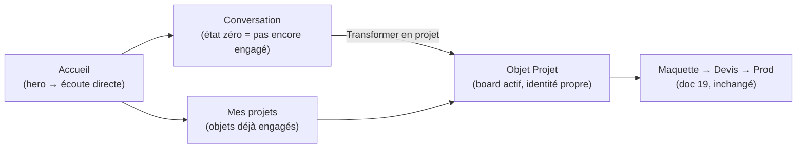

# 22 — Cadrage produit : la conversation comme surface, le Projet comme objet

> Cadrage PO de l'épic **`CLV-E-ARCHI`** (ticket `CLV-46`), 2026-07-04. Traduit en structure la
> décision de fond **déjà actée par Ben le 2026-07-03** (cf. `BACKLOG.md`, bloc « Reprise ») :
> on tue le switch Assistant/Projet, la conversation devient la surface unique, le Projet est un
> objet de 1er niveau créé depuis elle. **Ce document ne rouvre pas cette décision** — il la
> découpe en étages et en tickets exécutables.

## Convention (reprise de `BACKLOG.md`, à réutiliser telle quelle par le développeur et la QA)

- Projet **`CLV`**, tickets **`CLV-N`**, numérotation **contiguë et globale**. Dernier ticket
  numéroté avant celui-ci : `CLV-50` (`BACKLOG.md`) / `CLV-40` (`19-service-site.md`). Les
  **nouveaux** tickets issus de ce cadrage partent donc à **`CLV-51`**.
- État : ⬜ à faire · 🟦 en cours · ✅ fait · 🔶 à valider (Ben) — même code que `BACKLOG.md`.
- Ce document **raffine** l'épic `CLV-E-ARCHI` déjà ouvert (`CLV-46` à `CLV-50`) : les tickets
  existants gardent leur ID d'origine, seul leur contenu est précisé/éclaté. Il **rattache**
  aussi `CLV-41/42/44/45` (refonte espace Projet) et `CLV-50` (logo), déjà présents dans
  `BACKLOG.md` sous un autre bloc.
- Un ticket marqué **« clôt/remplace CLV-X »** signifie : CLV-X reste visible dans `BACKLOG.md`
  pour l'historique, mais son contenu est repris tel quel ici — pas de double maintenance
  (même pattern que `CLV-30` → `CLV-37` dans `19-service-site.md`).

---

## 1. Le modèle produit

**Une seule surface : la conversation.** Elle est l'état zéro de tout — y compris d'un projet
qui n'est pas encore engagé. Depuis elle, un geste explicite (« Transformer en projet », déjà
codé — `toProject()` dans `apps/web/app/echange/page.tsx`) fait naître un **objet Projet** :
une entité distincte, retrouvable, avec sa propre identité (titre, board, état), tracée jusqu'à
la conversation qui l'a fait naître (`sourceConversationId`, déjà posé dans `lib/history.ts`).

**Ce que devient l'accueil.** Plus de choix a priori (fini les 2 dalles Assistant/Projet de
`page.tsx` et le switch `SiteNav`). L'accueil **atterrit directement dans la conversation**
(l'expérience actuelle de `/echange` : micro, écoute, réponse — sans page de sélection avant).
« Plusieurs assistants » n'existe pas : **un fil + une mémoire par Projet**, jamais des
assistants rivaux qu'on choisirait au démarrage.

**Garde-fou non négociable (rappel du ticket `CLV-46`).** L'état « je fabrique » (= cet objet
est un Projet engagé) est porté par **l'objet lui-même** — a-t-il un board actif / la passerelle
a-t-elle été actionnée ? — **jamais** par une reclassification du modèle à chaque tour de parole.
C'est le bug que le switch réglait (doc `12-deux-modes.md`, fragilité n°1 : « un projet part
parfois en direct/board sans GO ») ; le supprimer sans ce garde-fou le rouvrirait.

---

## 2. Étage 1 (V1, cheap, sans Supabase) vs Étage 2 (V2, Supabase)

### Étage 1 — IN

- Retrait du switch `SiteNav` et de l'accueil 2 dalles (`page.tsx`).
- Nouvel accueil = hero + micro → atterrit directement dans la conversation (reprend
  l'expérience `/echange` telle quelle).
- La passerelle « Transformer en projet » reste **le seul geste** de création d'un objet Projet
  (mécanisme déjà codé), rendue plus visible/centrale.
- L'objet Projet reste porté par les mécanismes locaux **déjà existants** : IndexedDB
  (`StoredConversation`, `lib/history.ts`), champ `board`. **Aucun nouveau schéma de données.**
- Garde-fou câblé : le statut « Projet engagé » d'une conversation = état persistant et
  explicite (passerelle actionnée OU `board !== null`), jamais recalculé depuis une réponse LLM.
- Écran « Mes projets » : liste des objets déjà engagés (aujourd'hui les conversations
  `mode: "voice"`), présentée comme des **objets à retrouver**, pas comme un mode à choisir.
- Alignement avec la refonte d'espace Projet déjà validée par Ben (`CLV-41/42/44/45`).
- Reformulation de l'histoire du logo relais (`CLV-50`) sans référence au switch.

### Étage 1 — OUT (explicitement renvoyé à l'étage 2)

- Auth / comptes.
- Un fil **et** une mémoire propres à chaque Projet (aujourd'hui : une conversation a ses
  messages, mais pas de mémoire distillée dédiée par Projet).
- Persistance cross-appareils (Supabase).
- Réécriture du schéma de stockage (`mode: "echange" | "voice"` reste tel quel en étage 1 —
  c'est un changement de **présentation/UX**, pas de modèle de données).

### Étage 2 — IN

- Auth (compte utilisateur).
- Chaque Projet = son propre **fil + sa propre mémoire distillée** — résout « plusieurs
  assistants » par de la mémoire dédiée, pas par des assistants rivaux.
- Persistance Supabase cross-appareils, **upsert par id sans remapping** (le modèle
  `Conversation` posé dès l'étage 1/V1 de `CLV-E-HIST` est déjà pensé pour ça, cf.
  `13-historique-conversations.md` §8).
- Bloqueur : quota Supabase (cf. mémoire `cleveria-memoire-roadmap` et `08-analyse-business.md`
  §6 point 3).

### Étage 2 — OUT

- Refonte de l'orchestration factory / du run (`CLV-E-SITE`, `CLV-E-PAIEMENT` restent des
  chantiers séparés, doc `19-service-site.md`).
- Marque blanche / upsell agences (`CLV-49`, parké — post-hypothèse n°1).

**Chevauchement à signaler, pas à trancher ici.** `CLV-48` (ce document) recoupe fortement
l'épic déjà ouvert `CLV-MEM` (`BACKLOG.md`, bloc V2 : auth + Supabase + faits distillés).
Recommandation : garder `CLV-MEM` comme le ticket **mécanique** (auth/Supabase/mémoire
distillée, générique), `CLV-48` comme le ticket de **scope produit** (« appliqué par Projet »),
avec dépendance `CLV-48` → `CLV-MEM`. Qui tient `BACKLOG.md` tranche la fusion/dépendance finale.

---

## 3. Tickets actionnables

### `CLV-46` — Cadrage produit + archi cible *(ce document)*
**Livré** : le modèle produit (§1), le découpage étage 1/étage 2 (§2), les tickets (§3), les
questions ouvertes (§4).
**Fait =** Ben a tranché les questions ouvertes ; ce document sert de référence unique pour
`CLV-47/48/41/42/44/45/50` — aucun de ces tickets ne re-décide le modèle en cours de route.
**Dépendances** : aucune — bloque tout le reste de l'épic. **État : 🔶 à valider (Ben).**

### `CLV-47` — Étage 1 : retirer le switch, conversation = atterrissage *(ticket-cadre)*
Reste dans `BACKLOG.md` comme titre d'épic-enfant ; le contenu exécutable est éclaté en
`CLV-51` à `CLV-54` ci-dessous (pas de double maintenance).
**Dépendances** : `CLV-46`.

### `CLV-51` — Retirer `SiteNav` + fusionner l'accueil 2 dalles
**Livré** : `apps/web/app/components/SiteNav.tsx` supprimé de la navigation globale (ou son
rôle de sélecteur de mode retiré) ; `apps/web/app/page.tsx` n'affiche plus les deux slabs
Assistant/Projet — remplacé par un hero qui mène directement à l'expérience `/echange`.
**Fait =** aucune page ne montre plus de lien « Mode Assistant / Mode Projet » ; naviguer vers
`/` place l'utilisateur directement en état d'écoute de la conversation (comme `/echange`
aujourd'hui), zéro clic de choix de mode avant de pouvoir parler.
**Dépendances** : `CLV-46`. **Clôt/remplace `CLV-44`** (« repenser le switch ») — le switch
n'est plus redesigné, il est supprimé.

### `CLV-52` — Garde-fou : « Projet engagé » porté par l'objet, jamais par une classification LLM
**Livré** : règle produit + implémentation minimale — une conversation devient/reste un objet
Projet dès que (a) la passerelle a été actionnée OU (b) un board existe et est persisté
(`board !== null`) ; cet état ne se recalcule jamais à partir d'une réponse du modèle au tour
suivant.
**Fait =** sur une conversation ayant déjà un board, un refresh ne repasse jamais en « échange
pur » ; à l'inverse, un échange pur sans board ni passerelle actionnée ne bascule jamais en
Projet sans action explicite de l'utilisateur (testable en rejouant les deux scénarios).
**Dépendances** : `CLV-46`. Touche `lib/history.ts`/`StoredConversation` — à confirmer avec le
lead-tech si `board` suffit comme marqueur ou si un champ explicite (`engagedAt`) est plus sûr.

### `CLV-53` — La passerelle « Transformer en projet » devient le geste central et visible
**Livré** : le bouton déjà existant (`toProject()`) repositionné/mis en avant (pas relégué dans
une barre secondaire) ; wording qui dit explicitement « crée un Projet retrouvable » plutôt que
« changer de mode ».
**Fait =** le bouton est visible dès qu'un échange compte au moins 1 message ; cliquer dessus
crée un objet qui apparaît ensuite dans « Mes projets » (`CLV-54`) avec un titre dérivé du
besoin exprimé.
**Dépendances** : `CLV-51`, `CLV-52`.

### `CLV-54` — « Mes projets » : liste des objets déjà engagés, accessible depuis la conversation
**Livré** : écran/panneau listant les conversations `mode: "voice"` (= objets Projet) —
présenté comme une liste d'objets (titre, état résumé, date), pas comme un mode ; réutilise
`listConversations("voice")` déjà codé dans `lib/history.ts`.
**Fait =** depuis l'accueil/la conversation, un lien « Mes projets » ouvre cette liste ; cliquer
un item ouvre l'objet Projet correspondant (board + fil) ; un utilisateur sans projet voit un
état vide explicite (« aucun projet encore — transforme un échange en projet »).
**Dépendances** : `CLV-53`. Recoupe `CLV-45` (historisation peu découvrable) — même chantier de
découvrabilité, étendu aux objets Projet plutôt qu'à l'historique générique seul.

### `CLV-41` — Board : redimensionnement + scroll *(repris tel quel, déjà validé par Ben le 2026-07-03)*
S'applique à la vue détail de l'objet Projet (ouverte depuis `CLV-54`). Contenu inchangé par
rapport à `BACKLOG.md`. **Dépendances** : aucune nouvelle — cadrage UX déjà acté.

### `CLV-42` — Barre « Chef de projet » remontée au-dessus de la discussion *(repris tel quel)*
S'applique à la même vue objet Projet. Combine avec `CLV-45`. **Dépendances** : `CLV-51` (le
header n'a plus de switch à côté une fois retiré).

### `CLV-44` — *(clôt, remplacé par `CLV-51`)* Repenser le switch Assistant/Projet
Caduc suite à la décision de fond : on ne redesigne pas le switch, on le **supprime**. À
marquer dans `BACKLOG.md` comme « remplacé par `CLV-51` » (même traitement que `CLV-30` →
`CLV-37` dans `19-service-site.md`), pas fermé silencieusement.

### `CLV-45` — Historisation peu découvrable *(repris, étendu)*
Reste valide pour retrouver ses **échanges** passés (conversations sans Projet) ; sa partie
« retrouver ses objets Projet » est reprise par `CLV-54`. **Dépendances** : `CLV-42`, `CLV-54`.

### `CLV-50` — Reformuler l'histoire du logo « relais » *(repris tel quel)*
**Fait =** `docs/17`/`docs/15` ne mentionnent plus la bascule Échange→Projet comme origine du
logo ; la nouvelle histoire (« toi → l'équipe qui prend le relais pour livrer ») est cohérente
avec le modèle conversation→objet Projet de ce document.
**Dépendances** : rédaction possible en parallèle, mais publication finale après `CLV-51` (pour
ne pas raconter un logo autour d'un switch qui vient de disparaître).

### `CLV-48` — Étage 2 : projets first-class + fil & mémoire par projet *(ticket-cadre)*
**Livré** : architecture posée (pas codée) dès l'étage 1 pour ne pas fermer la porte — le
modèle `StoredConversation` est déjà pensé pour un upsert Supabase par id (doc 13 §8).
**Dépendances** : `CLV-46`, et consolidation avec `CLV-MEM` (cf. §2, chevauchement signalé).
Bloqueur : quota Supabase, auth. Sous-tickets à ouvrir seulement une fois `CLV-MEM` engagé —
non détaillés ici pour ne pas dupliquer ce travail.

### `CLV-49` — Upsell / B2B2C *(parké, inchangé)*
Cf. `BACKLOG.md` — à explorer après validation de l'hypothèse n°1 (doc `08-analyse-business.md`).

---

## 4. Questions ouvertes — décision de Benoit (produit, pas technique)

1. **Le pitch sur l'accueil.** Le hero doit-il « vendre » le Projet (montrer des exemples de
   projets livrés, une preuve sociale) alors que la surface d'atterrissage est la conversation —
   ou le pitch Projet reste-t-il uniquement dans le copywriting (titre/sous-titre), sans rien
   montrer avant le 1er message ? → **change la maquette de l'accueil** (`CLV-51`).
2. **Même fil ou nouveau fil à la passerelle ?** Aujourd'hui `toProject()` crée une **nouvelle**
   conversation (`mode: "voice"`) et y bascule. Est-ce le modèle voulu (« un Projet = un fil
   séparé, tracé vers sa source ») ou le MÊME fil doit-il « monter en compétence » sans créer de
   nouvelle entrée d'historique ? → **change fortement l'implémentation de `CLV-52`/`CLV-53`**
   et le modèle mental « un Projet = un fil ».
3. **« Mes projets » visible dès l'accueil, ou seulement depuis la conversation ?** Pour un
   utilisateur qui revient (déjà 1+ projet engagé), la liste doit-elle apparaître avant même le
   1er message de la session, ou seulement une fois qu'il a commencé à parler ? → **change la
   hiérarchie de l'accueil** (`CLV-51`/`CLV-54`).
4. **Vocabulaire utilisateur.** « Objet Projet » / « Mes projets » sont le vocabulaire de ce
   cadrage — doivent-ils apparaître tels quels dans l'UI, ou Ben veut-il un mot moins jargonneux
   (« mes chantiers », « mes livraisons »… ) ? → **change le wording de `CLV-51/53/54`**, donc
   les maquettes associées.

---

*Fichier produit par le PO pour clore `CLV-46`. Ne modifie pas `BACKLOG.md` — à consolider par
qui le tient (report des états, clôture de `CLV-44`, ouverture de `CLV-51`→`CLV-54`).*
